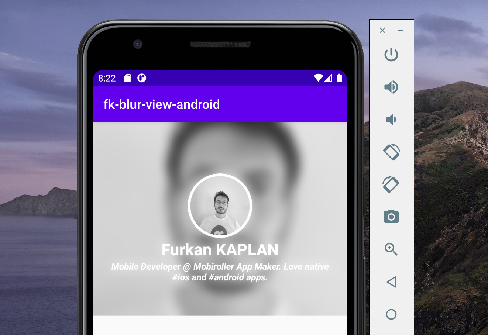
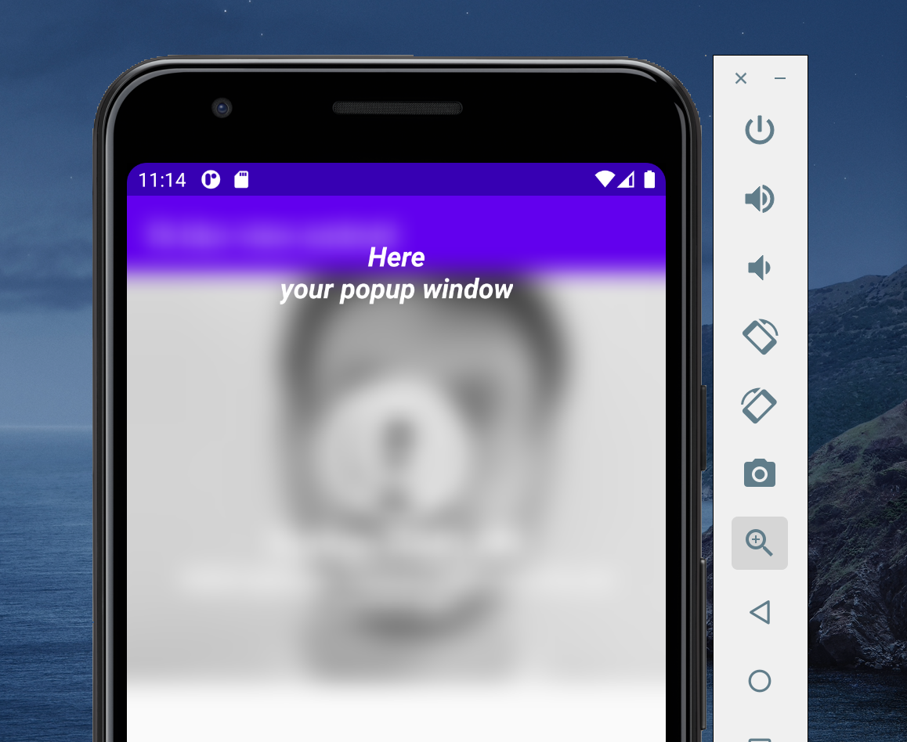

# FKBlurView

If you are familiar with iOS app development, you have used UIVisualEffectView at least one time. iOS SDK has this view for years but unfortunately Android SDK doesn't provide a native solution. This library provides you FKBlurView which is alternative of UIVisualEffectView in iOS. 
You can use it in everywhere as a background of a dialog view or part of a profile page etc.

## How to install?

You can add the library to your project using **jitpack.io**. 

Add the code below to your **project's gradle** file.
```
   allprojects {
        repositories {
            jcenter()
            maven { url "https://jitpack.io" }
        }
   }
```

Add the code below to your **app's gradle** file.
```
   dependencies {
        implementation 'com.github.furkankaplan:fk-blur-view-android:1.0.1'
   }
```   
**Partial View Usage Screenshot**



**Popup Window Background Usage Screenshot**



## How to use?

In this example, you can blur banner_image_view with the FKBlurView.

activity_main.xml
```
<androidx.constraintlayout.widget.ConstraintLayout xmlns:android="http://schemas.android.com/apk/res/android"
    xmlns:app="http://schemas.android.com/apk/res-auto"
    xmlns:tools="http://schemas.android.com/tools"
    android:layout_width="match_parent"
    android:layout_height="match_parent"
    tools:context=".MainActivity">
    
     <ImageView
        android:id="@+id/banner_image_view"
        android:layout_width="match_parent"
        android:layout_height="300dp"
        android:scaleType="center"
        app:layout_constraintTop_toTopOf="parent"
        app:layout_constraintStart_toStartOf="parent"
        app:layout_constraintEnd_toEndOf="parent"
        android:src="@drawable/profile_picture"/>

    <com.github.furkankaplan.fkblurview.FKBlurView
        android:id="@+id/fkBlurView"
        android:layout_width="0dp"
        android:layout_height="0dp"
        app:layout_constraintTop_toTopOf="@id/banner_image_view"
        app:layout_constraintStart_toStartOf="@id/banner_image_view"
        app:layout_constraintEnd_toEndOf="@id/banner_image_view"
        app:layout_constraintBottom_toBottomOf="@id/banner_image_view"/>
        
</androidx.constraintlayout.widget.ConstraintLayout>
```
MainActivity.java
```
 FKBlurView blurView = findViewById(R.id.fkBlurView);
 // Blur level starts from 1. It's minimum level.
 // Default blurLevel 50 if you don't pass any value. or use blurView.getBlur(this, blurView, 20);
 blurView.getBlur(this, blurView);
```

*Or* you can make blur the background of custom Popup Window layout. It's so simple like previous example.

MainActivity.java
```
LayoutInflater inflater = (LayoutInflater) getSystemService(Context.LAYOUT_INFLATER_SERVICE);

View v = inflater.inflate(R.layout.popup, (ViewGroup) findViewById(R.id.root_fk_blur_view));

FKBlurView popupBlurView = v.findViewById(R.id.root_fk_blur_view);
popupBlurView.setBlurBackground(MainActivity.this, popupBlurView);

final PopupWindow errorPopup = new PopupWindow(v,
        getWindowManager().getDefaultDisplay().getWidth(),
        getWindowManager().getDefaultDisplay().getHeight(), true);

errorPopup.showAtLocation(v, Gravity.CENTER, 0, 0);
```

activity_main.xml
```
<?xml version="1.0" encoding="utf-8"?>
<com.github.furkankaplan.fkblurview.FKBlurView android:id="@+id/root_fk_blur_view"
    xmlns:android="http://schemas.android.com/apk/res/android"
    android:layout_width="match_parent"
    android:layout_height="match_parent"
    xmlns:app="http://schemas.android.com/apk/res-auto">

    <TextView
        android:layout_width="wrap_content"
        android:layout_height="wrap_content"
        android:layout_marginTop="30dp"
        android:text="Here\nyour popup window"
        android:textAlignment="center"
        android:textStyle="bold|italic"
        android:textColor="@android:color/white"
        android:textSize="20dp"
        app:layout_constraintStart_toStartOf="parent"
        app:layout_constraintEnd_toEndOf="parent"
        app:layout_constraintTop_toTopOf="parent"
        android:gravity="center_horizontal" />
</com.github.furkankaplan.fkblurview.FKBlurView>
```        
You can check it out all previews in **example** folder.

## Author

Furkan Kaplan https://github.com/furkankaplan <br>
Twitter  : [@furkaplan](https://twitter.com/furkaplan) <br>
LinkedIn : [@furkankaplan07](https://www.linkedin.com/in/furkankaplan07/) <br>
Email    : **furkankaplan@outlook.com**
